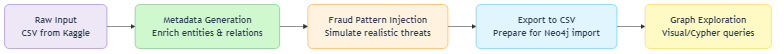
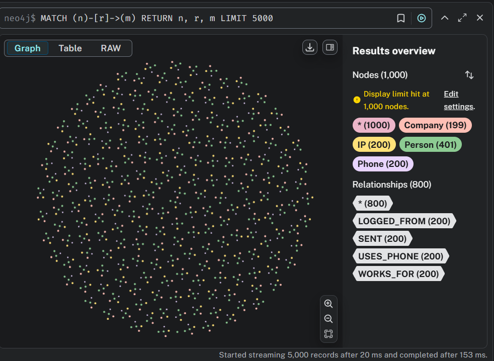
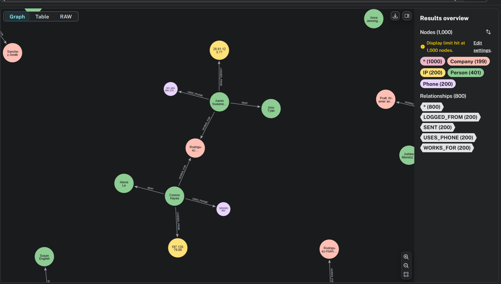
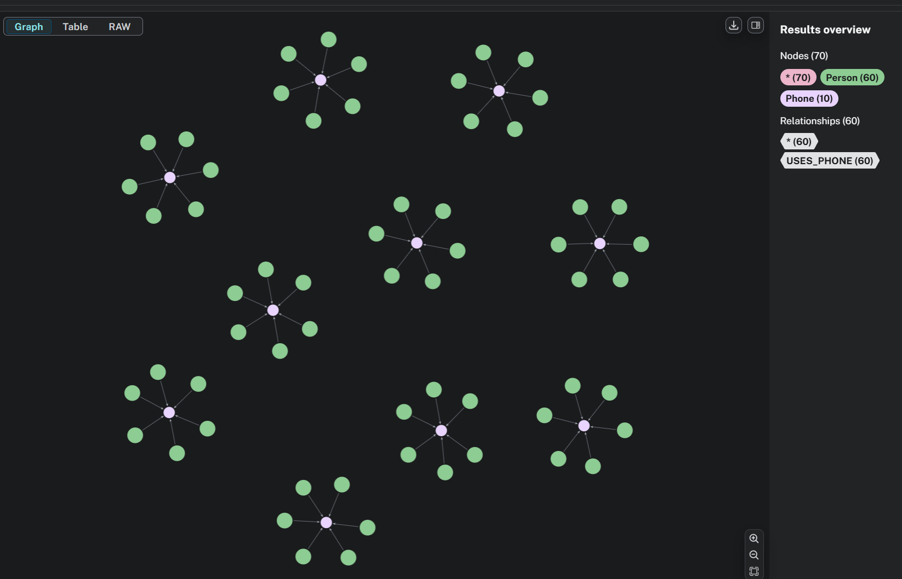
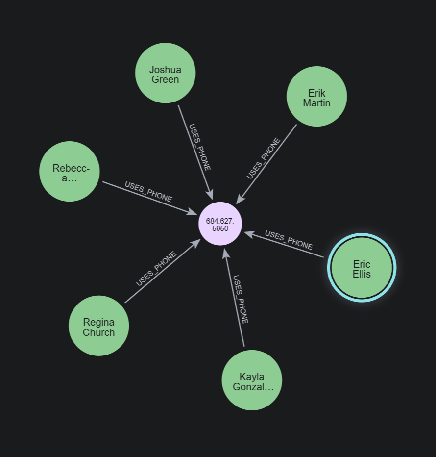

# Fraud Graph Demo
A lightweight, high-performance pipeline for graph-based fraud detection, clean, local, and focused on transparency.  
This is a research prototype designed for exploration, built around explainability and creative thinking.

## Why this project?

In financial transactions, fraud rarely acts alone. It moves through *networks*. Imagine this: 50 fake accounts, all tied to the same 10 phone numbers. Why? Because it’s the oldest trick in the book:"reuse, camouflage, confuse. One fraudster can pretend to be dozens of people, using the same IPs, employers, or devices.


This prototype turns plain transaction logs into a connected graph of people, companies, devices, and activity, then highlights suspicious patterns:

- Shared identities (e.g. phones, IPs) between unrelated users
- Money loops that simulate trust but actually obfuscate the origin
- Dormant accounts activated only to receive transfers — possible money mules
- Fake companies used to justify legitimacy

It’s part of my personal portfolio to showcase:

- Graph thinking applied to fraud analytics
- Enriching raw data into typed entities and relationships
- Neo4j as a tool for intuitive fraud investigation
- Modular, interpretable code designed for insight

### Why Graphs for Fraud?

In a table, you see rows. In a graph, you see *structure*.

Fraudulent behavior often hides in how entities are linked:

- If 12 users share the same phone number: anomaly.
- If account A sends to B and B sends back to A: money laundering loop.
- If 40 employees all work for the same fake company: synthetic identity ring.

Graph databases like Neo4j expose these patterns visually and computationally, without complicated joins - just paths, nodes, and relationships.

## Folder Structure
```
fraud-graph-demo/
│
├── assets/
│ ├── pipeline_flow.mmd # mermaid diagram
│
├── data/
│ ├── raw/ # Original input file (from Kaggle)
│ └── processed/ # All generated node + edge CSVs
│
├── notebooks/ # Data exploration + export scripts
│ ├── 01_generate_metadata.ipynb
│ ├── 02_inject_fraud_patterns.ipynb
│ └── 03_export_for_neo4j.ipynb
│
├── neo4j/ # Cypher scripts to load + query graph
│ ├── load.cypher
│ └── queries.cypher
│
├── scripts/ # Same content as notebooks but as .py scripts
│
├── streamlit_app/ (WIP/planned)
├── requirements.txt
└── README.md
```

## About the dataset

This project is based on the [Kaggle PaySim Dataset](https://www.kaggle.com/datasets/ealaxi/paysim1), a simulation of mobile money transactions — great for prototyping fraud detection logic.

> ⚠️ **Note**: The raw file `PS_20174392719_1491204439457_log.csv` (~470MB) cannot be committed to GitHub due to size limits.  
> To run the pipeline, download it manually from the Kaggle link above and place it in:  
> `data/raw/`

## Pipeline Flow

1. **Raw Input**
   - Load transaction logs from CSV

2. **Metadata Generation**
   - Enrich each user with synthetic attributes: phone, IP, employer
   - Create nodes and relationships: `Person`, `Phone`, `Company`, `IP`
   - Define edges: `SENT`, `USES_PHONE`, `LOGGED_FROM`, `WORKS_FOR`

3. **Fraud Pattern Injection (Optional)**
   - Inject synthetic but realistic behaviors:
     - Shared phones/IPs across unrelated accounts
     - Money loops (e.g. A → B → A)
     - Dormant receiver-only accounts (mules)
     - Fake employer reuse

4. **Export to Neo4j**
   - Generate CSVs for import
   - Use `neo4j/load.cypher` to ingest into a Neo4j instance

5. **Graph Exploration**
   - Query and explore patterns using `queries.cypher` or Neo4j Bloom




This project doesn’t rely on black-box ML, it’s **transparent, interpretable, and built for real human investigation**.

We inject known behavioral patterns to simulate realistic threats:

- **Phone Reuse**  
  A single phone number tied to multiple user accounts or identities, a classic fraudster trick.

- **Circular Transfers**  
  Funds looping between accounts (e.g., A → B → A) to obscure traceability and simulate legitimacy.

- **Fake Employers**  
  Multiple users linked to the same fake company, often used to justify income or create trust anchors.

- **Receiver-Only Accounts**  
  Dormant accounts that suddenly come alive just to receive funds, often acting as *mules* in fraud rings.

> All of these behaviors are encoded as graph structures, easy to trace visually or query using Cypher in Neo4j.


## Setup & Usage

1. **Clone the repo and create your environment**
```bash
git clone https://github.com/gabmansur/fraud-graph-demo
cd fraud-graph-demo
python -m venv .venv
source .venv/bin/activate  # or .venv\Scripts\activate on Windows
pip install -r requirements.txt
```

2. **Open the Notebooks**
The core logic lives inside three clean, easy-to-follow notebooks

| Notebook                         | Purpose                                                                                                                  |
| -------------------------------- | ------------------------------------------------------------------------------------------------------------------------ |
| `01_generate_metadata.ipynb`     | Cleans the raw transaction file and enriches it with metadata like unique phone numbers, company IDs, and user profiles. |
| `02_inject_fraud_patterns.ipynb` | Injects synthetic but realistic fraud patterns into the graph (e.g. loops, reused devices, mule accounts).               |
| `03_export_for_neo4j.ipynb`      | Converts the graph into CSV files compatible with Neo4j’s `LOAD CSV` Cypher command.                                     |

Just run them in order. Each cell is commented and modular.

3. **Launch Neo4j (Optional)**
If you want to visualize the graph:

- Start Neo4j locally (you can use Neo4j Desktop or Docker)
- Use the neo4j/load.cypher script to ingest the graph
- Explore patterns visually or run predefined queries in neo4j/queries.cypher

## Use Case: detecting a Fraud Ring with Graph Analytics

Imagine you're a data engineer at a financial institution reviewing new account registrations. You notice a spike in applications — all approved — but soon after, multiple chargebacks and suspicious behavior occur.

You ask yourself:

- Are these real people?
- Are these independent users?
- Or… is there a coordinated fraud ring slipping through?

You decide to load the data into a graph database, connect the dots between users, phone numbers, IP addresses, and companies… and what you find will change how you see data forever.

### Investigation Flow

#### Phase 1: Map the Full Jungle
Goal: Get the lay of the land.

Key Questions:
- Where are the dense clusters?
- Are there isolated subgraphs?
- Are some nodes overly connected (hubs)?
- Is there one person using too many devices, or too many people using the same device?

```
MATCH (n)-[r]->(m)
RETURN n, r, m
LIMIT 5000
```




#### Phase 2: Investigate Identity Overlap via Phones
Goal: Catch multiple people using the same phone; this is very unlikely in real life unless something shady is going on.

Key Questions:
- Are several people connected to the same phone number?
- Could this indicate duplicate or fake accounts?
- Is it possible that multiple identities were created using a single device?

```
MATCH (p1:Person)-[r1:USES_PHONE]->(ph:Phone)<-[r2:USES_PHONE]-(p2:Person)
WHERE p1 <> p2
RETURN p1, p2, ph, r1, r2
```
>This query finds people using the same phone — a typical pattern in fraud rings where the same burner phone is recycled.




💬 We found groups of individuals connected to the exact same phone number. While it could be explained by household sharing, this pattern starts to raise flags, especially when it's more than 2-3 people, or appears repeatedly across the graph.

#### Phase 3: Strengthen the Case: Add IP Overlap
Goal: Check if these same people also log in from the same IP addresses.

Key Questions:
- Are these users logging in from the same IP address?
- Does the overlap in phones and IPs indicate coordinated identity use?
- Is this beyond coincidence?

## What makes this project cool?

- Clean, local Python setup, no cloud dependencies
- Uses Spark for scale, but small enough to run on a laptop
- Graph-based fraud detection logic
- Full Pytest test coverage
- Modular, well-commented codebase

## Roadmap

- Add machine learning fraud classifiers
- Integrate with Neo4j for more complex graph querying
- Create interactive dashboard (e.g. Streamlit or Gradio)
- Setup LFS for easier dataset sharing

## ❓FAQ

**Q: Where’s the full dataset?**  
A: Too big for GitHub! You’ll find the download link and setup info above.

**Q: Why use Spark locally?**  
A: It’s efficient, parallel, and you’ll thank me if you scale this later. It may seem like overkill for a small dataset, but Spark gives me scalable architecture if I want to plug in real financial data later. Plus, it's great for distributed joins and data enrichment.

**Q: Can I use this as a base for my own fraud detection project?**   
A: Yes! Just credit me (and the original dataset authors) if you publish it.

**Q: Why did you choose a graph database instead of a relational one?**   
A: Graphs are ideal for uncovering relationships, especially in fraud where links between people, accounts, devices, and companies reveal hidden clusters or patterns. A relational DB can store the data, but exploring connections like loops or shared entities would require complex joins. Neo4j makes that intuitive and visual.

**Q: Why Neo4j specifically?**   
A: Neo4j is optimized for fast traversal and relationship-first design. It also has a great developer experience, easy to load, query with Cypher, and visualize graphs in a way that makes patterns jump out. For a research prototype, it was perfect.

**Q: Why not NetworkX or other Python graph libs?**   
A: NetworkX is great for graph analysis in-memory, but it’s not optimized for large-scale persistent graph exploration. Neo4j lets me store the data, run Cypher queries, and visually explore fraud rings which is much more aligned with real-life investigations.

**Q: Why didn’t you use machine learning for fraud detection?**   
I intentionally focused on transparency and interpretability over predictive accuracy. In real-life fraud cases, explainability matters and investigators want to see why something looks suspicious. This project simulates known behaviors instead of relying on black-box models. But I do plan to add ML layers later as a comparison.

**Q: Why Jupyter notebooks and not a proper Python module or CLI?**   
A: Notebooks allow for clearer walkthroughs of the logic, especially when showcasing transformations, visualizing steps, and annotating thought processes. But the logic is modular enough that it could easily be converted to .py scripts or even an app later, I structured it with that in mind.

**Q: How would you productionize this?**   
A: For production, I’d move the enrichment logic into scheduled PySpark jobs, export the entities to a graph DB hosted in the cloud, and expose key fraud patterns through a dashboard (Streamlit or a proper frontend). Neo4j has enterprise options too, and could be swapped out with something like TigerGraph if scale demands.

**Q: Aren’t these fraud patterns synthetic? How realistic are they?**   
A: Yes, the patterns are synthetic, but they’re based on real fraud behaviors, like identity reuse, circular transactions, and mules. I chose patterns seen in the wild and injected them to make the dataset more investigative. It’s not meant to mimic every case, just to surface the kinds of behaviors fraud analysts look for.

**Q: Could this be biased or unfair?**   
A: In real-world systems, bias is a huge concern, especially if we assign risk scores or make decisions. This project is exploratory and transparent by design, with manually-injected patterns. It doesn’t label any user as “fraud”,  it simply highlights behaviors worth reviewing.

**Q: What would you improve if you had more time?**   
A: I’d add more fraud typologies, create a live dashboard with alerts, integrate a graph ML layer (e.g., node embeddings or link prediction), and refactor the logic into testable Python modules. Possibly even connect real anonymized data for validation...? Who knows

**Q: What’s the coolest thing you discovered while building this?**   
A: That even tinyyy changes in structure like a shared IP between two “unrelated” users can completely shift the graph layout and reveal hidden fraud rings. You feel the pattern, it’s incredibly visual and intuitive, which I didn’t expect to this degree!

**Q: Are Tom and Mia involved?**   
A: They supervised the testing phase and provided purring QA support. Also if you see typos or strange stuff, it's their keyboard walking routine.

## From the heart

This project reflects how I like to work: clean, smart, curious, and creative.  
If you’re hiring or collaborating, I’d love to talk.

— Gabi
