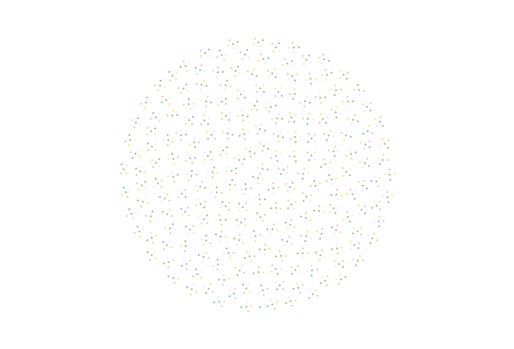
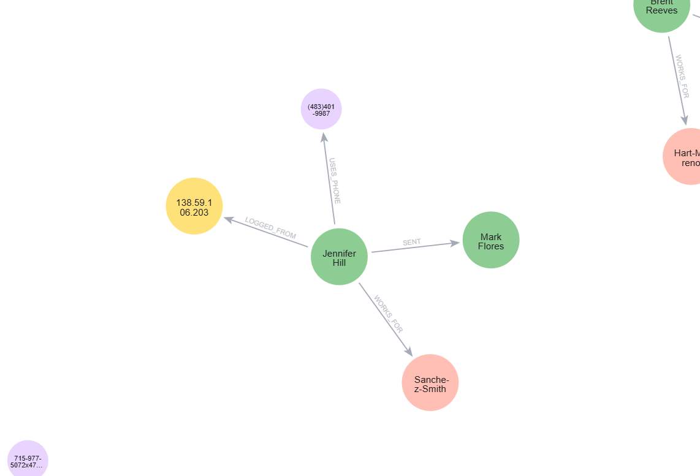

# Fraud Graph Data
A lightweight, high-performance pipeline for graph-based fraud detection, clean, local, and focused on transparency.  
This is a research prototype designed for exploration, built around explainability and creative thinking.

## Table of Contents
1. [Why this project?](#why-this-project)
2. [Folder Structure](#folder-structure)
3. [About the dataset](#about-the-dataset)
4. [Pipeline Flow](#pipeline-flow)
5. [Setup & Usage](#setup--usage)
6. [Use Case: Detecting a Fraud Ring with Graph Analytics](#use-case-detecting-a-fraud-ring-with-graph-analytics)
   - [Investigation Flow](#investigation-flow)
     - [Phase 1: Map the Full Network](#phase-1-map-the-full-network)
     - [Phase 2: Check for Phone Overlap](#phase-2-check-for-phone-overlap)
     - [Phase 3: Phone + IP Overlap](#phase-3-phone--ip-overlap-coordinated-use)
     - [Phase 4: Ring Detection & Case Prioritization](#phase-4-ring-detection--case-prioritization)
     - [Next Steps](#next-steps)
7. [What makes this project cool?](#what-makes-this-project-cool)
8. [Roadmap](#roadmap)
9. [FAQ](#faq)


## Why this project?

In financial transactions, fraud rarely acts alone. It moves through networks. Imagine 50 fake accounts tied to the same 10 phone numbers. Why? It’s the oldest trick in the book: reuse, camouflage, confuse. One fraudster can pretend to be dozens of people by reusing IPs, employers, or devices.

This prototype turns plain transaction logs into a connected graph of people, companies, devices, and activity, then highlights suspicious patterns:

- Shared identities (e.g. phones, IPs) between unrelated users
- Money loops that simulate trust but actually obfuscate the origin
- Dormant accounts activated only to receive transfers, possible money mules
- Fake companies used to justify legitimacy

It’s part of my personal portfolio to showcase:

- Graph thinking applied to fraud analytics
- Enriching raw data into typed entities and relationships
- Neo4j as a tool for intuitive fraud investigation
- Modular, interpretable code designed for insight

### Why Graphs for Fraud?

In a table, you see rows. In a graph, you see *structure*.

Fraudulent behavior often hides in how entities are linked:

- If 12 users share the same phone number: anomaly.
- If account A sends to B and B sends back to A: money laundering loop.
- If 40 employees all work for the same fake company: synthetic identity ring.

Graph databases like Neo4j expose these patterns visually and computationally, without complicated joins, just paths, nodes, and relationships. Node types used here: Person, Phone, IP, Company, and transaction edges between People.

## Folder Structure
```
fraud-graph-data/
│
├── assets/ # Diagrams & visuals
│
├── data/
│   ├── raw/                  # Raw transaction data
│   ├── processed/            # Output CSVs ready for Neo4j import
│
├── notebooks/
│   ├── 01_generate_metadata.ipynb
│   ├── 02_inject_fraud_patterns.ipynb
│   ├── 03_export_for_neo4j.ipynb
│   └── 04_analyze_graph.ipynb
│
├── neo4j/
│   ├── load_graph.py         # Python driver to run Cypher scripts
│   ├── load.cypher           # Bulk-import CSVs into Neo4j
│   └── queries.cypher        # Catalog of queries for fraud pattern detection
│
├── scripts/                  # Utility scripts (optional / extra)
│
├── streamlit_app/            # Planned Streamlit dashboard (future work)
│   └── app.py
│
├── .env.example              # Example environment variables for Neo4j
├── requirements.txt
├── README.md
└── .gitignore
```

**Environment file**

Create your .env from the example in the repo root:

```bash
cp .env.example .env
```

Edit `.env` and set:

```ini
NEO4J_URI=bolt://localhost:7687
NEO4J_USER=neo4j
NEO4J_PASSWORD=your_password
NEO4J_DATABASE=neo4j   # optional if your default DB is already 'neo4j'
# STOP_ON_ERROR=true   # optional: stop loader on first error
```
## About the dataset

This project is based on the [Kaggle PaySim Dataset](https://www.kaggle.com/datasets/ealaxi/paysim1), a simulation of mobile money transactions, great for prototyping fraud detection logic.

> ⚠️ **Note**: The raw file `PS_20174392719_1491204439457_log.csv` (~470MB) cannot be committed to GitHub due to size limits.  
> To run the pipeline, download it manually from the Kaggle link above and place it in:  
> `data/raw/`

## Pipeline Flow

0. **Raw Input**
   - Load transaction logs from CSV

1. **Metadata Generation**
   - Enrich each user with synthetic attributes: phone, IP, employer
   - Create nodes and relationships: `Person`, `Phone`, `Company`, `IP`
   - Define edges: `SENT`, `USES_PHONE`, `LOGGED_FROM`, `WORKS_FOR`

2. **Fraud Pattern Injection**
   - Inject synthetic but realistic behaviors:
     - Shared phones/IPs across unrelated accounts
     - Money loops (e.g. A → B → A)
     - Dormant receiver-only accounts (mules)
     - Fake employer reuse

3. **Export to Neo4j**
   - Generate CSVs for import
   - Use `neo4j/load.cypher` to ingest into a Neo4j instance
   - Exports include:
      - data/processed/nodes_person.csv, nodes_phone.csv, nodes_ip.csv, nodes_company.csv
      - data/processed/relationships_sent.csv, relationships_uses_phone.csv, relationships_logged_from.csv, relationships_works_for.csv

4. **Graph Exploration**
   - Query and explore patterns using `queries.cypher` or Neo4j Bloom


This project doesn’t rely on black-box ML, it’s **transparent, interpretable, and built for real human investigation**.

We inject known behavioral patterns to simulate realistic threats:

- **Phone Reuse**  
  A single phone number tied to multiple user accounts or identities, a classic fraudster trick.

- **Circular Transfers**  
  Funds looping between accounts (e.g., A → B → A) to obscure traceability and simulate legitimacy.

- **Fake Employers**  
  Multiple users linked to the same fake company, often used to justify income or create trust anchors.

- **Receiver-Only Accounts**  
  Dormant accounts that suddenly come alive just to receive funds, often acting as *mules* in fraud rings.

> All of these behaviors are encoded as graph structures, easy to trace visually or query using Cypher in Neo4j.


## Setup & Usage

1. **Clone the repo and create your environment**
```bash
git clone https://github.com/gabmansur/fraud-graph-data
cd fraud-graph-data
python -m venv .venv
source .venv/bin/activate  # or .venv\Scripts\activate on Windows
pip install -r requirements.txt
```

2. **Open the Notebooks**

The core logic lives inside three clean, easy-to-follow notebooks

| Notebook                         | Purpose                                                                                                                  |
| -------------------------------- | ------------------------------------------------------------------------------------------------------------------------ |
| `01_generate_metadata.ipynb`     | Cleans the raw transaction file and enriches it with metadata like unique phone numbers, company IDs, and user profiles. |
| `02_inject_fraud_patterns.ipynb` | Injects synthetic but realistic fraud patterns into the graph (e.g. loops, reused devices, mule accounts).               |
| `03_export_for_neo4j.ipynb`      | Converts the graph into CSV files compatible with Neo4j’s `LOAD CSV` Cypher command.                                     |
| `04_analyze_graph.ipynb` | Optional QA. Validates shared phones/IPs and phone+IP pairs with pandas, and exports the "Top 5 phone+IP overlaps" table used in Phase 3. |

Run 01 → 02 → 03 → 04 in order. Each cell is commented and modular. Neo4j’s `neo4j/load.cypher`

3. **Launch Neo4j (Optional)**

If you want to visualize the graph:

1. Start Neo4j locally (you can use Neo4j Desktop or Docker)
2. Load the graph data
   - Use the `neo4j/load.cypher` script directly in Neo4j Browser, **or**
   - Run the Python driver script from the repo.

**Neo4j import note**

Copy .env.example to .env and update the values:

``` bash
NEO4J_URI=bolt://localhost:7687
NEO4J_USER=neo4j
NEO4J_PASSWORD=your_password
NEO4J_DATABASE=neo4j  # optional if default DB name is 'neo4j'
```

Then run:

```bash
python neo4j/load_graph.py                       # runs neo4j/load.cypher
python neo4j/load_graph.py neo4j/queries.cypher  # runs the query catalog
```

The loader reads the Cypher file, splits on semicolons, skips comments, and runs each statement inside a write transaction, so multi-statement imports work as-is.

4. **Query Catalogue**

All Cypher queries for analysis, pattern detection, and graph maintenance are stored in neo4j/queries.cypher. They are grouped into clearly labeled sections for quick reference:

A. Schema & Indexes
- Constraints – Ensures unique keys for core entities (e.g., Person, Phone, IP, Company).
- Performance indexes – Improves lookup speed on high-use properties.

B. Sanity & Exploration
- Counts by label – Quick snapshot of how many nodes per label exist.
- Counts by relationship type – Quick snapshot of edge counts per relationship type.
- Top-degree hubs – Identifies people with the highest number of connections.

C. Phase Queries
- Phase 1 – Map the Full Network
- Phase 2 – Check for Phone Overlap
- Phase 3 – Check for Phone + IP overlap
- Phase 4 – Ring Detection & Case Prioritization

D. Fraud Patterns & Scores (commented out by default)
- Short money loops – 2–5 hop loops between accounts.
- Fan-in/Fan-out anomalies – Accounts with unusual incoming/outgoing patterns.
- Multi-identifier linkage – Links a person to all connected identifiers.
- Rule-based risk scoring – Starter example for assigning risk points.

> 💡 These are commented out to avoid running heavy pattern-matching by accident.
Uncomment only the queries you want to execute.

E. Maintenance / Utilities
- E1 – Upsert guards – Idempotent node creation to avoid duplicates on reload.
- E2 – Duplicate relationship cleanup – Removes redundant edges with the same (src, dst, txn_id).

Keeping this section ensures the graph stays clean and efficient over time.

In summary, how to use:
1. Schema setup & data load → run neo4j/load.cypher through load_graph.py.
2. Exploration & pattern detection → open neo4j/queries.cypher and run queries as needed.
3. Uncomment specific D queries when testing fraud patterns.

## Use Case: detecting a Fraud Ring with Graph Analytics

Imagine you're a data engineer at a financial institution reviewing new account registrations. You notice a spike in applications, all approved, but soon after, multiple chargebacks and suspicious behavior occur.

You ask yourself:

- Are these real people?
- Are these independent users?
- Or… is there a coordinated fraud ring slipping through?

By loading the data into a graph database and connecting users, phones, IPs, and companies, you can start to see the structure behind the noise.

### Investigation Flow

#### Phase 1: Map the Full Network
Goal: Get the lay of the land before chasing specific suspects.

When starting any fraud investigation, the first move is to zoom all the way out. We want to see the entire jungle of relationships in the dataset. This gives us:

- The overall shape of the network
- Where activity is concentrated
- Whether there are “loners” or hidden pockets of activity
- Which nodes are abnormally well-connected (possible hubs)

Key Questions:

- Where are the dense clusters?
- Are there isolated subgraphs?
- Which nodes are overly connected?
- Do any devices connect to multiple people?

First, we unleash the entire network:

```
MATCH (n)-[r]->(m)
RETURN n, r, m
LIMIT 5000
```


Each dot = an entity (person, phone, IP, company). Edges = relationships. Clusters = potential fraud communities.

It’s chaotic and messy but exactly what we expect from raw data. This "jungle view" is crucial because it tells us:

- The dataset is rich enough for investigation
- There are clear hotspots of activity worth zooming into later
- We might already spot suspicious patterns just from the density of certain nodes

When we get closer, a normal pattern emerges:

- A person who sends money to another person
- Works for a certain company
- Linked to a phone number
- Linked to an IP address

This is the baseline, the normal anatomy of a user in our network. Later phases will contrast this "healthy" structure against the tangled and unnatural ones where fraud lives.


#### Phase 2: Check for Phone Overlap
Goal: Find multiple people using the same phone, which is rare in legitimate contexts.

In Phase 1 we mapped the whole jungle. Now we start zooming in on unusual device usage. A phone number should normally have a 1-to-1 relationship with a person.
When multiple people use the same one, we have three possibilities:

- Household sharing (legitimate, but rare)
- Work devices (possible, but usually traceable)
- Fraud ring recycling (common in illicit activity)

Key Questions:
- How many people share the same phone number?
- Could this be shared devices, or does it point to fake accounts?
- Does the same phone appear in multiple clusters?

Here’s what it looks like when we plot these overlaps:

```
MATCH (p1:Person)-[r1:USES_PHONE]->(ph:Phone)<-[r2:USES_PHONE]-(p2:Person)
WHERE p1 <> p2
RETURN p1, p2, ph, r1, r2
```


We discovered groups of individuals connected to the same phone number.
While 2–3 people might be explainable, larger clusters, especially ones that pop up across different parts of the network, start to look like organized account farming.

These overlapping phone numbers become anchors in the investigation.
In the next phase, we’ll check whether these same people also share IP addresses, a much stronger indicator of coordinated activity.

#### Phase 3: Phone + IP overlap (coordinated use)
Goal: Escalate from "possible connection" to "high-probability fraud ring" by checking if phone overlaps are reinforced by IP overlaps.

Key Questions:

- How many accounts share both a phone and an IP?
- Are these overlaps small (2–3 people) or large (full rings)?
- Do the same phone+IP combos appear in different parts of the network?
- Are these overlaps connected to known suspicious clusters from Phases 1 & 2?
- Could any of these overlaps be explained by legitimate scenarios (shared office, family), or do they fit classic fraud patterns?

In Phase 2, we uncovered clusters of accounts sharing the same phone number, which is suspicious, but not enough to convict. After all, a family, a shared business line or even a community phone could explain it.

But now we add the second layer: IP addresses. If the same people also log in from the exact same IP, across multiple accounts, the probability of coincidence collapses. This is where analysts start to move from possible fraud to highly likely.

A shared phone might be innocent and a shared IP might be innocent, but together it flags for a coordinated login footprint. It’s classic behavior in:

- Fake account farms
- Botnets
- Collusive fraud groups

As a rule-of-thumb, 

> Phone overlap = shared access point

> IP overlap = shared network location

> Both = the same actors controlling multiple identities

We now rank all phone+IP combinations by the number of unique accounts involved. The bigger the group, the more likely it’s a ring.

```
// Top 5 phone+IP combos, cleaned and de-duped
MATCH (p:Person)-[:USES_PHONE]->(ph:Phone),
      (p)-[:LOGGED_FROM]->(ip:IP)
WITH ph.number AS phone,
     ip.value  AS ip,
     collect(DISTINCT p.person_id) AS people,
     count(DISTINCT p) AS cnt
WHERE phone IS NOT NULL AND phone <> ''
  AND ip    IS NOT NULL AND ip    <> ''
  AND cnt > 1
RETURN phone, ip, cnt AS count, people
ORDER BY count DESC
LIMIT 5;
```

Below are the top 5 phone+IP overlaps with the most people involved. Each row is a potential fraud ring, with the Count column showing how many unique people share that phone+IP combo. 

| Phone               | IP              | Count | People                                                        |
| ------------------- | --------------- | --- | ------------------------------------------------------------- |
| 977-292-4230x006    | 211.154.39.34   | 5   | C807101143, C691065771, C1292484867, C555990868, C83179166    |
| +1-686-798-2595x620 | 113.146.189.29  | 5   | C25552315, C1916496762, C1979501645, M582886129, C95566755    |
| +1-686-798-2595x620 | 223.204.219.231 | 5   | C25552315, C1916496762, C1979501645, M582886129, C95566755    |
| 518.527.6297x9472   | 160.81.157.73   | 5   | C1653380908, C153833710, C1002270002, C276022566, C1179955657 |
| 977-292-4230x006    | 13.73.32.43     | 5   | C807101143, C691065771, C1292484867, C555990868, C83179166    |

**Visualizing a Fraud Ring**

Let’s take one example: Phone 977-292-4230x006 + IP 13.73.32.43.
This single combination links five different accounts, each one tied to the same phone and IP.

**What this tells us**

- These accounts are all logging in from the same network and using the same phone
- Multiple identities are being run from the same setup, almost certainly the same operator
- If we layered transaction data or device fingerprints here, we could directly tie them to the same entity


With these overlaps in hand, a fraud team would typically:

- Pull login timestamps → Check if accounts were active within seconds/minutes of each other.
- Inspect device fingerprints → Same browser, OS, screen resolution = same machine.
- Cross-check transactions → Look for repeated recipients, identical amounts, or timing patterns.
- Time-window analysis → Were these accounts created close together?
- Trace IP ownership → Is this a residential IP, a VPN, or a data center?

<p align="center">
  
  
</p>

**Legend:**  
- 🟢 Green = Person  
- 🟣 Purple = Phone  
- 🟡 Yellow = IP  

**Left:** Phase 2 network view, showing connections between people and shared phone numbers.  
**Right:** Phase 3 view, introducing IP addresses into the analysis to spot overlaps and possible shared devices/networks.

#### Phase 4: Ring Detection & Case Prioritization

After identifying high-risk overlaps in Phase 3 (shared phone + IP combinations across multiple users), Phase 4 takes the investigation further: instead of looking at overlaps in isolation, we group them into rings - clusters of users linked by the same contact and network footprint.

Goal: turn the overlaps into concrete groups you can review as ***cases***.

Key questions:

- How many distinct phone+IP clusters exist?
- What is the size distribution of these clusters?
- Which cluster should we triage first?

**What we found**

Running the grouping queries revealed:

- Total rings detected: 8
- Largest ring size: 5 people sharing the same phone + IP
- Smallest ring size: 2 people
- Average ring size: ~3 people
- Multi-ring members: 2 individuals appeared in more than one ring (possible brokers/mules connecting groups)

**Why this matters**

Rather than chasing down dozens of isolated overlaps, Phase 4 reduces the workload by:
- Collapsing redundant overlaps into distinct case files (one per ring)
- Giving investigators a priority queue (largest, most connected rings first)
- Exposing bridge accounts - people who link multiple rings and may indicate organized activity

#### Next steps
With the rings defined, analysts can pull each cluster into the Neo4j Browser or Bloom to visually inspect the relationships, enrich them with external intel (e.g., geolocation, account age), and decide which to escalate.

## What makes this project cool?

- Clean, local Python setup, no cloud dependencies
- Graph-first fraud logic with clear, explainable patterns
- Neo4j import and a reproducible query catalog
- Modular notebooks you can lift into scripts later

## Roadmap

| Phase | Feature / Goal                           | Impact                                                                                                                  |
| ----- | ---------------------------------------- | ----------------------------------------------------------------------------------------------------------------------- |
| **1** | **Machine Learning Classifiers**         | Train supervised/unsupervised models to detect fraud patterns automatically and benchmark against rule-based detection. |
| **2** | **Advanced Graph Querying in Neo4j**     | Leverage Cypher queries and graph algorithms (e.g., community detection, shortest paths) for deeper fraud insights.     |
| **3** | **Interactive Dashboard**                | Build a user-friendly interface with Streamlit or Gradio to explore suspicious patterns in real time.                   |
| **4** | **Data Management Improvements**         | Implement Git LFS or cloud storage for easier dataset sharing and versioning.                                           |
| **5** | **Alert & Monitoring System**            | Automate alerts when suspicious activity patterns emerge.                                                               |

## ❓FAQ

**Q: Where’s the full dataset?**  
A: Too big for GitHub! You’ll find the download link and setup info above.

**Q: Why use Spark locally?**  
A: It’s efficient, parallel, and you’ll thank me if you scale this later. It may seem like overkill for a small dataset, but Spark gives me scalable architecture if I want to plug in real financial data later. Plus, it's great for distributed joins and data enrichment.

**Q: Can I use this as a base for my own fraud detection project?**   
A: Yes! Just credit me (and the original dataset authors) if you publish it.

**Q: Why did you choose a graph database instead of a relational one?**   
A: Graphs are ideal for uncovering relationships, especially in fraud where links between people, accounts, devices, and companies reveal hidden clusters or patterns. A relational DB can store the data, but exploring connections like loops or shared entities would require complex joins. Neo4j makes that intuitive and visual.

**Q: Why Neo4j specifically?**   
A: Neo4j is optimized for fast traversal and relationship-first design. It also has a great developer experience, easy to load, query with Cypher, and visualize graphs in a way that makes patterns jump out. For a research prototype, it was perfect.

**Q: Why not NetworkX or other Python graph libs?**   
A: NetworkX is great for graph analysis in-memory, but it’s not optimized for large-scale persistent graph exploration. Neo4j lets me store the data, run Cypher queries, and visually explore fraud rings which is much more aligned with real-life investigations.

**Q: Why didn’t you use machine learning for fraud detection?**   
I intentionally focused on transparency and interpretability over predictive accuracy. In real-life fraud cases, explainability matters and investigators want to see why something looks suspicious. This project simulates known behaviors instead of relying on black-box models. But I do plan to add ML layers later as a comparison.

**Q: Why Jupyter notebooks and not a proper Python module or CLI?**   
A: Notebooks allow for clearer walkthroughs of the logic, especially when showcasing transformations, visualizing steps, and annotating thought processes. But the logic is modular enough that it could easily be converted to .py scripts or even an app later, I structured it with that in mind.

**Q: How would you productionize this?**   
A: For production, I’d move the enrichment logic into scheduled PySpark jobs, export the entities to a graph DB hosted in the cloud, and expose key fraud patterns through a dashboard (Streamlit or a proper frontend). Neo4j has enterprise options too, and could be swapped out with something like TigerGraph if scale demands.

**Q: Aren’t these fraud patterns synthetic? How realistic are they?**   
A: Yes, the patterns are synthetic, but they’re based on real fraud behaviors, like identity reuse, circular transactions, and mules. I chose patterns seen in the wild and injected them to make the dataset more investigative. It’s not meant to mimic every case, just to surface the kinds of behaviors fraud analysts look for.

**Q: Could this be biased or unfair?**   
A: In real-world systems, bias is a huge concern, especially if we assign risk scores or make decisions. This project is exploratory and transparent by design, with manually-injected patterns. It doesn’t label any user as “fraud”,  it simply highlights behaviors worth reviewing.

**Q: What would you improve if you had more time?**   
A: I’d add more fraud typologies, create a live dashboard with alerts, integrate a graph ML layer (e.g., node embeddings or link prediction), and refactor the logic into testable Python modules. Possibly even connect real anonymized data for validation...? Who knows

**Q: What’s the coolest thing you discovered while building this?**   
A: That even tinyyy changes in structure like a shared IP between two “unrelated” users can completely shift the graph layout and reveal hidden fraud rings. You feel the pattern, it’s incredibly visual and intuitive, which I didn’t expect to this degree!

**Q: Are Tom and Mia involved?**   
A: They supervised the testing phase and provided purring QA support. Also if you see typos or strange stuff, it's their keyboard walking routine.

## From the heart

This project reflects how I like to work: clean, smart, curious, and creative.  
If you’re hiring or collaborating, I’d love to talk.

— Gabi
